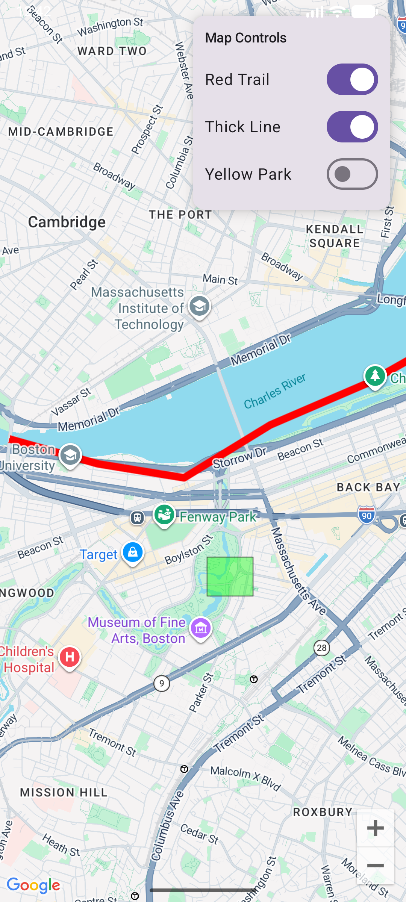

# Q3: Interactive Polylines and Polygons

## 1. Description
This application demonstrates advanced geometric rendering and reactive UI controls using the **Google Maps SDK** and **Jetpack Compose**. It features a "Map Control Center" that allows users to modify the visual properties of map layers in real-time.

### Key Features & Requirements
* **Requirement 1 (Polyline)**: Renders a multi-point path following the **Boston Esplanade** trail. The path is built with high-density coordinates to accurately follow the river's curvature.
* **Requirement 2 (Polygon)**: Displays a semi-transparent geometric area representing the **Back Bay Fens** park.
* **Requirement 3 (Customization UI)**: Features a floating **Material3 Card** with interactive **Switches**. Users can toggle:
    * Trail Color (Blue vs. Red)
    * Trail Thickness (Thin vs. Thick)
    * Park Fill Color (Green vs. Yellow)
* **Requirement 4 (Click Listeners)**: Both the Polyline and Polygon are "Clickable." Tapping either shape triggers a **Toast notification** identifying the specific area/trail.

---

## 2. Technical Implementation
* **Reactive State**: Uses `mutableStateOf` and `remember` to track toggle positions. The map elements use **derived state** logic to update their appearance instantly without reloading the map.
* **Geometry Density**: Unlike basic 2-point lines, the Esplanade trail utilizes a 7-point coordinate array to prevent the "water-walking" glitch and maintain alignment with the Charles River shoreline.
* **Layered Layout**: Utilizes a `Box` layout to overlay the Control Card on the Map, ensuring the controls remain accessible while navigating the map.

---

## 3. Technical Specifications
* **Min SDK**: 26
* **Target SDK**: 36
* **Maps Library**: `com.google.maps.android:maps-compose:4.3.3`
* **Secrets Management**: Configured with the **Secrets Gradle Plugin** to protect the API Key in `local.properties`.

---

## 4. How to Use
1. **Toggle Design**: Use the "Map Controls" card in the top-right corner to change the map's theme.
2. **Interact**: Tap on the Blue/Red trail or the Green/Yellow park area to see a description of the location.
3. **Navigate**: The map starts centered on the BU Bridge/West Campus area.

### Gameplay Screenshot

## 5. AI Disclosure
I utilized Gemini to help me figure out coordinates for my trail (which took a lot of trial and error and is still janky). Also, Gemini assited in helping me obsure my API from this public github. In addition, it helped me verify I had met the requirements, format a few comments, and draft this README!
